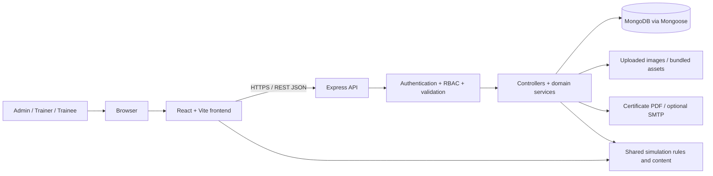

# UK LogiWare — Workplace Safety Training Platform

**Interactive warehouse safety training · 360° learning · Role-based management · MERN stack**

UK LogiWare is a full-stack web application developed by **Bug Busters** for logistics and warehouse workplace training. It combines managed training programmes, practical learning activities, a navigable 360° warehouse tour, interactive puzzles and safety missions, assessment records, progression analytics, badges, and completion certificates.

The platform has three user roles: **Administrator**, **Trainer**, and **Trainee**. The React frontend communicates with an Express REST API, and MongoDB stores users, programmes, attempts, progress, and system records.

> **Project scope:** This README describes functionality and commands found in the provided Sprint 1–4 source archive. It is a development/project handover guide, **not a claim that the application has been externally deployed, independently security-audited, or certified for safety compliance**. Production use requires the hardening and acceptance checks described below.

## Contents

1. [Highlights](#highlights)
2. [Technology stack](#technology-stack)
3. [Getting started — local development](#getting-started--local-development)
4. [First-time configuration and demonstration workflow](#first-time-configuration-and-demonstration-workflow)
5. [User roles and permissions](#user-roles-and-permissions)
6. [Features and training experience](#features-and-training-experience)
7. [System architecture](#system-architecture)
8. [Repository structure](#repository-structure)
9. [Environment variable reference](#environment-variable-reference)
10. [Database and data setup](#database-and-data-setup)
11. [REST API overview](#rest-api-overview)
12. [Testing and quality checks](#testing-and-quality-checks)
13. [Available npm commands](#available-npm-commands)
14. [Security and privacy](#security-and-privacy)
15. [Deployment guide and release checklist](#deployment-guide-and-release-checklist)
16. [Troubleshooting](#troubleshooting)
17. [Known limitations and project handover notes](#known-limitations-and-project-handover-notes)
18. [Sprint delivery and contributors](#sprint-delivery-and-contributors)

---

## Highlights

| Area | What the application provides |
| --- | --- |
| Accounts | Admin-created trainer/trainee accounts, credential generation, login, password changes, account state controls |
| Access | Role-based frontend routes and protected backend API operations; trainer access scoped to authorised modules/programmes |
| Training | Dynamic modules, programmes, levels, learning sections, images, assignments, and progress |
| Warehouse experience | 360° panoramas, hotspots, location navigation, a warehouse map, previews, and admin panorama management |
| Interactive activities | Scenario decisions, timed puzzles, hazard/prop activities, and stateful safety simulation missions |
| Assessments | Question banks, randomised attempt questions, answers, pass marks, and attempt history |
| Progress | Trainee progress, module/programme views, scores, personal bests, and trainer monitoring |
| Management | Admin reports, audit logs, notifications, password-reset requests, and training configuration |
| Recognition | Badges; cumulative completion certificate requests, downloadable PDFs, and optional email delivery |
| Interface | Responsive layouts, separate role dashboards, profiles, and light/dark display settings |

### Included training areas

- **Manual Handling:** safe lifting, carrying, load checks, mechanical aids, route safety, and hazard awareness.
- **Working at Height:** ladders, platforms, fall prevention, tools, exclusion zones, and safe preparation.
- **Cyber Awareness:** phishing, passwords, MFA, devices, sensitive information, social engineering, and incident reporting.

These are the three built-in programme types/content banks. Administrators can also create training module records; additional module types may need their own activity content and imagery before offering the same learning experience.

---

## Technology stack

| Layer | Technologies found in the project |
| --- | --- |
| Frontend | React 19, React DOM, React Router 7, Vite 8 |
| UI styling | CSS, Tailwind CSS 4, Tailwind Vite plugin, role-specific and theme-specific styles |
| HTTP client | Axios with access-token and refresh handling |
| Backend | Node.js, Express 5, CommonJS controllers/routes/services |
| Database | MongoDB with Mongoose 9 |
| Authentication | JWT, bcrypt password hashing, refresh tokens, cookies |
| File handling | Multer, Sharp, uploaded images and local static assets |
| Email/PDF | Custom SMTP service, certificate PDF generation |
| Automated tests | Jest 30, Supertest, `mongodb-memory-server` using a system MongoDB executable |
| Shared game logic | JavaScript modules in `shared/` for simulation engine, templates, and mission library |

**Required Node.js version:** `>=22.12.0` according to the frontend and backend `package.json` files. Use a supported recent Node 22+ release and a compatible npm version.

---

## Getting started — local development

These instructions work whether you receive the project as a ZIP file or clone it from GitHub. They assume the application will run on your own computer using a **local MongoDB database**, a backend on port **5000**, and a frontend on port **5173**.

### 1. Install prerequisites

1. **Node.js and npm** — confirm in a terminal:
   ```bash
   node --version
   npm --version
   ```
2. **MongoDB Community Server** — install it locally or obtain a valid MongoDB connection string from a database service. MongoDB Compass is optional and is not the database server.
3. **Git** — optional if starting from the ZIP; needed for cloning/pushing source.
4. **A code editor** — VS Code or another editor.
5. **A modern browser** — Chrome, Firefox, or Edge.

### 2. Open the project folder

**From the supplied ZIP:** extract it, open the outer `Logistic_warehouse` folder, and confirm that you see `backend/`, `frontend/`, `shared/`, and `README.md`.

**From the source repository:**

```bash
git clone https://github.com/siddarthasubedi1/Logistic_warehouse.git
cd Logistic_warehouse
```

All commands below assume the current working directory is the **project root**, unless a different directory is shown. The project does **not** define a root-level `npm start`; run frontend and backend separately.

### 3. Start MongoDB

If MongoDB was installed as a Windows service, start the **MongoDB Server** service in Windows Services. Otherwise, start `mongod` using the setup for your OS.

For a local instance, the connection string is:

```text
mongodb://127.0.0.1:27017/logistic_warehouse
```

You can check that the server is accessible with `mongosh`, if installed:

```bash
mongosh "mongodb://127.0.0.1:27017/logistic_warehouse"
```

On Windows, if you run MongoDB manually, create an appropriate data directory first (for example `C:\data\db`) and start `mongod` with `--dbpath` pointing to it. Keep the MongoDB process running. **Installing MongoDB Compass alone will not start MongoDB Server.**

### 4. Install the backend dependencies

**Terminal 1 — from the project root:**

```bash
cd backend
npm ci
```

`npm ci` uses the included `package-lock.json` for a repeatable dependency install. It replaces any copied `node_modules`, which is particularly important when moving this ZIP between operating systems. If you intentionally change package versions, use `npm install` and review the updated lockfile instead.

### 5. Configure `backend/.env`

The backend loads environment variables from `backend/.env`. **The provided ZIP already contains a backend `.env`: preserve it if you need its local settings, but do not publish it or reuse potentially exposed secrets.** On a clean Git checkout, create it yourself.

Example development configuration (**replace placeholders**):

```dotenv
NODE_ENV=development
PORT=5000
CLIENT_URL=http://localhost:5173
MONGO_URI=mongodb://127.0.0.1:27017/logistic_warehouse

JWT_ACCESS_SECRET=REPLACE_WITH_FIRST_LONG_RANDOM_SECRET
JWT_REFRESH_SECRET=REPLACE_WITH_SECOND_DIFFERENT_RANDOM_SECRET
ACCESS_TOKEN_EXPIRES_IN=15m
REFRESH_TOKEN_EXPIRES_IN=7d

TRUST_PROXY=0
SEED_STARTER_CONTENT=false
CERTIFICATE_MODULE_KEYS=manual-handling,working-at-height,cyber-awareness
```

Generate **two different** strong secrets, running this command twice from a terminal with Node.js:

```bash
node -e "console.log(require('crypto').randomBytes(32).toString('hex'))"
```

Put the first generated value in `JWT_ACCESS_SECRET` and the second in `JWT_REFRESH_SECRET`. The server will refuse to start if `MONGO_URI`, `JWT_ACCESS_SECRET`, or `JWT_REFRESH_SECRET` is missing.

> **Important:** Values in this README are examples, not live credentials. Do not commit `.env`, admin passwords, SMTP passwords, or exported databases to the repository. Rotate secrets that were included in archives shared beyond the development team.

### 6. Create the first Administrator account

Before you can log in or manage training, create an admin account. Add these **temporary** entries to `backend/.env`:

```dotenv
ADMIN_BOOTSTRAP_USERNAME=admin
ADMIN_BOOTSTRAP_EMAIL=admin@example.com
ADMIN_BOOTSTRAP_PASSWORD=REPLACE_WITH_A_UNIQUE_STRONG_PASSWORD
```

The bootstrap password must have at least **12 characters** and must not exceed **72 UTF-8 bytes**. From the `backend/` folder, run:

```bash
npm run create:admin
```

The script creates the **first** administrator only, hashes its password, and does not print the password. If an administrator already exists, it leaves the existing admin unchanged. After successful creation, remove the bootstrap password from the file and keep it in a trusted password manager.

> Do not run the general training-content seed simply to create an admin: that script also creates sample users, programmes, assignments and test data.

### 7. Prepare Sprint 4 database indexes and badge definitions

Still inside `backend/`, run:

```bash
npm run setup:sprint4
```

This is the included idempotent setup for relevant MongoDB indexes and the three badge definitions. It is designed to preserve existing attempts and training records. Back up any existing data before running migration/repair tools on a valuable database.

### 8. Start the backend

From `backend/`:

```bash
npm run dev
```

Or run without file watching:

```bash
npm start
```

Expected startup messages include a successful MongoDB connection and a server listening on port 5000. The server also checks/repairs relevant challenge and progress indexes, checks starter puzzles, and attempts to sync the mission library where an active administrator and matching programmes are available.

Confirm the backend is healthy by visiting:

- `http://localhost:5000/api/health` — database-aware health check
- `http://localhost:5000/api/test` — simple backend response

The health endpoint should return HTTP `200` with a connected database when ready. A failed database connection or missing mandatory env setting prevents normal startup.

### 9. Install and start the frontend

**Terminal 2 — from the project root:**

```bash
cd frontend
npm ci
```

The ZIP has `frontend/.env.example`. Create `frontend/.env` with the API address:

```dotenv
VITE_API_URL=http://localhost:5000/api
```

On Windows PowerShell, from `frontend/`, you can create it using:

```powershell
Copy-Item .env.example .env
```

Start Vite:

```bash
npm run dev
```

Vite normally reports:

```text
Local: http://localhost:5173/
```

Open **http://localhost:5173** in your browser, log in using the administrator account created in Step 6, and begin configuring training.

> If Vite uses `5174` or another port because `5173` is occupied, update `CLIENT_URL` in `backend/.env` to the **exact origin reported by Vite**, then restart the backend. Otherwise requests or refresh cookies can fail due to CORS.

### Quick daily startup after initial setup

Once dependencies, environment variables, and the admin account are configured, you normally only need:

**1. Start MongoDB.**

**2. Backend terminal:**

```bash
cd Logistic_warehouse/backend
npm run dev
```

**3. Frontend terminal:**

```bash
cd Logistic_warehouse/frontend
npm run dev
```

**4. Browser:** `http://localhost:5173`

You do **not** need to run `npm ci`, `create:admin`, or `setup:sprint4` every day.

---

## First-time configuration and demonstration workflow

A freshly created database has no real users, modules, or programmes until they are created or seeded. The following workflow exercises the application with genuine records rather than assuming that a new installation already has training data.

1. Log in as **Administrator**.
2. Open **Training Programmes** and create the required **training modules**, such as Manual Handling, Working at Height, and Cyber Awareness, unless they already exist.
3. Create a **programme** within a module. Provide its title, descriptions, learning objectives, owner, difficulty level (`beginner`, `intermediate`, or `advanced`), pass mark, and status.
4. Add or review **learning sections**, images, scenarios, assessment questions, and puzzle/simulation activities. Starter-content helpers exist, but you should check that content is appropriate for the intended demonstration.
5. Set programmes to **active** and create the needed training assignments. The system has automatic trainee access/assignment support, but visible programmes and activity access still depend on active records and the relevant programme/assignment logic.
6. Create a **Trainer** and a **Trainee** using the admin user-management interface. Generate their accounts and credentials. Assign the Trainer only the module(s) they should manage.
7. Sign in as the Trainer, change the temporary password when prompted, manage authorised training content, and check monitoring/results.
8. Sign in as the Trainee, change the temporary password when prompted, open **My Training**, follow learning sections, explore the warehouse tour, complete assessments, and try puzzles and safety missions.
9. Return to the administrator dashboard to review users, training reports, audit logs, notifications, and any eligible certificate requests.

**Recommended demo sequence:** Admin dashboard → Create user/module/programme → Trainer content management → Trainee 360° tour → Learning → Puzzle/mission → Assessment → Progress → Admin reports/certificate screen.

---

## User roles and permissions

| Capability | Administrator | Trainer | Trainee |
| --- | :---: | :---: | :---: |
| Sign in, view own profile, and use theme preference | Yes | Yes | Yes |
| Manage users, roles, activation, and credentials | Yes | No | No |
| Create/edit/remove training modules | Yes | No | No |
| Manage training programmes and learning sections | Yes | Authorised programmes only | No |
| Manage scenarios, questions, puzzles, safety simulations | Yes | Authorised content only | No |
| Manage trainee assignments | Yes | No | No |
| Upload/manage central panoramas | Yes | No | No |
| Take assessments and interactive activities | No | No | Yes |
| View own learning history and badges | No | No | Yes |
| Review trainee results/monitoring | Admin reporting/records | Authorised programme scope | Own results only |
| View audit logs and organisation-wide reports | Yes | No | No |
| Manage and download certificate requests | Yes | No | Own certificate endpoints, where available |

A Trainer's access is based on **assigned module keys and programme ownership/authorisation**, not simply on holding the Trainer role. Admin-created trainee accounts receive active-module association logic, while access to actual lessons and attempts is checked against training/programme availability.

The frontend uses `ProtectedRoute`; the backend independently applies authentication, active-account checks, role authorisation, and resource-scoping rules. **Backend checks are the security boundary.**

---

## Features and training experience

### 1. Authentication and account management

- Username/password login, access JWTs, refresh sessions, and logout.
- bcrypt password hashes; an HTTP-only refresh-token cookie; token renewal through `/api/auth/refresh`.
- Forced first-login password change for users issued temporary credentials where configured.
- Admin registration of pending Trainer/Trainee users, credential generation, profile editing, activation/deactivation, deletion, password resets, and training module assignments.
- Password-reset request intake and administrator handling.
- Profile image upload/delete for Trainer and Trainee users, and stored light/dark preference.
- Login rate limiting and protected API routes.

### 2. Training modules, programmes, and learning sections

- Dynamic module records with name, unique key, code, description, image, and active/inactive status.
- Programmes with module type, title, short/full description, learning objectives, prerequisite, cover image, difficulty, owner, authorised trainers, pass mark, and lifecycle status.
- Learning sections with content, order, status, images, and previous/next navigation.
- Section completion tracking and programme-level activity eligibility/progression.
- Programme and assignment management; historical training records are maintained for reporting where relevant.

### 3. Interactive 360° warehouse experience

- Panoramic warehouse scenes and navigation hotspots.
- Location map and separate destination panorama preview; camera pan/navigation, fullscreen support, and keyboard controls in the trainee experience.
- Bundled warehouse imagery in `frontend/public/panoramas/`, with local fallback scenes when the tour API has no configured panorama records.
- Admin panorama creation/editing/removal, image upload, scene data, and hotspot connections.
- Module environments for the warehouse safety and cyber-awareness training contexts.

The panoramic scenes are image-based **360° experiences**, not a native VR headset integration or a physically simulated 3D warehouse.

### 4. Scenarios, assessments, and result records

- Scenario-based hazard decisions and stored scenario attempts.
- Programme/level assessment questions, answer checking, scoring, pass marks, and persisted assessment attempts.
- The starter assessment bank targets **at least 30 active questions for a programme/assessment level**; the assessment controller selects **up to 10 questions per attempt**, with randomised question/option ordering.
- Level restrictions and progression controls are enforced in the backend.
- Management views for question/scenario editing and attempt records.

### 5. Puzzles and personal bests

- Ordering challenges, prop-matching activities, and environmental/hazard interactions.
- **Eight starter ordering puzzles per module and difficulty level**: 3 modules × 3 levels × 8 puzzles = **72 starter puzzles**.
- In the ordering puzzle experience, the frontend **draws up to five activities from the available pool** when the puzzle screen opens or the user requests a new set.
- Beginner, Intermediate, and Advanced settings include different timed/point configurations.
- Server-validated attempts, hints, results, attempt history, personal bests, and leaderboard views.
- Ordering challenge scores are not awarded at random; attempt results are determined by validated answers and challenge rules.

These figures describe bundled starter content. The number visible to a user still depends on published/active programmes and puzzles in MongoDB.

### 6. Safety simulation missions

- A shared simulation engine that validates actions, prerequisites, state, scoring, and completion.
- Interactive scene/object selection, required action sequences, feedback, time limits, and mistakes/penalties.
- **45 bundled missions**: five missions per difficulty for each of the three module areas.
- Admin/Trainer mission creation, editing, preview, status changes, duplicate/archive actions, and results viewing according to permissions.
- Trainee mission starts, action submissions, completion, and leaderboard scores.
- Bundled SVG illustrations in `frontend/public/simulation-images/`.

The mission sync is designed to avoid overwriting existing trainer edits, and missions are linked to suitable training programmes. A clean database with no matching programmes can have missions awaiting setup.

### 7. Training progress, monitoring, and reports

- Trainee summary views with module/programme breakdowns, learning completion, assessment state, scores, and progress history.
- Trainer monitoring, trainee detail views, results, and recent activity for authorised training scope.
- Admin report overview, attempt records, training assignments, and audit log viewing.
- Notifications with unread counts and mark-as-read actions.
- Three achievement categories: programme completion, hazard achievement, and quiz achievement.

### 8. Completion certificates

- Certificate eligibility is calculated from **completed learning sections and passed assessments** for available module/level programmes.
- **Scenarios, puzzles, and safety missions are enrichment activities, not mandatory certificate requirements** under the current certificate service.
- Once at least **one configured module** is complete, the service can create a **cumulative certificate request**. As further modules are completed, the cumulative certificate record can be updated/superseded to reflect additional completed modules.
- Eligible certificate records include module information, a generated certificate number, and performance ratings based on assessment attempts and time per question.
- Admin certificate review, PDF download, optional SMTP emailing, manual notification confirmation, and signed time-limited public PDF links.
- The public link feature requires a reachable **HTTPS backend URL** in `PUBLIC_API_URL`; `localhost` is deliberately rejected.
- Without SMTP configuration, PDF download/manual notification can still be used, but automatic email delivery is unavailable.

### 9. User experience and accessibility-related code

- Role-specific dashboards and sidebars; multiple responsive layout and theme stylesheets.
- Dark and light modes, contrast/readability adjustments, and profile presentation controls.
- Loading, empty-state, status, confirmation, and feedback components.
- Interactive training screens with modal/keyboard/drag-style controls as implemented.

Responsive and accessibility styling exists in the code, but full WCAG conformance has **not** been verified by this README.

---

## System architecture



**Request lifecycle**

1. React displays the appropriate role dashboard and sends API requests through `frontend/src/services/api.js`.
2. The Axios client sends the access token; refresh requests include credentialed cookies.
3. Express routes validate the session, active status, and permissions.
4. Controllers call domain services and Mongoose models to read/update MongoDB.
5. Attempts, completion, achievements, audit events, and notifications are saved and displayed in the relevant dashboard.

### Frontend areas

- `frontend/src/App.jsx` — application route configuration.
- `frontend/src/components/` — shared layout, forms, auth, admin, trainer, trainee, and simulation components.
- `frontend/src/pages/` — dashboards and feature pages.
- `frontend/src/services/api.js` — Axios API configuration and token refresh behavior.
- `frontend/src/utils/` — session, theme, modules, and training helpers.
- `frontend/src/styles/` — responsive and theme styles.
- `frontend/public/` — panoramas, icons, puzzle art, and simulation art.

### Backend areas

- `backend/app.js` — Express app, middleware, static upload routes, API mounting, and error handlers.
- `backend/server.js` — MongoDB connection, startup validation, index migrations, content checks, and HTTP server.
- `backend/src/routes/` — REST endpoints, middleware, and role restrictions.
- `backend/src/controllers/` — HTTP request handlers.
- `backend/src/services/` — business logic for access, progress, achievements, simulations, certificates, reporting, and content.
- `backend/src/models/` — Mongoose schemas and indexes.
- `backend/src/middleware/` — auth, upload, validation, and account status checks.
- `backend/src/scripts/`, `backend/src/seeds/` — administrator bootstrap, database setup, repairs, and demonstration data.
- `backend/test/`, `backend/checks/` — automated tests and additional checks.
- `shared/` — mission definitions and common simulation calculations.

---

## Repository structure

```text
Logistic_warehouse/
├── README.md
├── backend/
│   ├── .env                     # private, local only; never commit
│   ├── .gitignore
│   ├── app.js
│   ├── server.js
│   ├── package.json
│   ├── package-lock.json
│   ├── jest.config.js
│   ├── checks/
│   │   ├── productionSmoke.cjs
│   │   ├── benchmarkProgress.cjs
│   │   └── verifyMissionLibrary.cjs
│   ├── src/
│   │   ├── assets/
│   │   ├── controllers/
│   │   ├── middleware/
│   │   ├── models/
│   │   ├── routes/
│   │   ├── services/
│   │   ├── utils/
│   │   ├── scripts/
│   │   └── seeds/
│   ├── test/
│   └── uploads/               # runtime-uploaded media
├── frontend/
│   ├── .env.example
│   ├── index.html
│   ├── package.json
│   ├── package-lock.json
│   ├── vite.config.js
│   ├── public/
│   │   ├── panoramas/
│   │   ├── puzzle-images/
│   │   └── simulation-images/
│   └── src/
│       ├── App.jsx
│       ├── main.jsx
│       ├── index.css
│       ├── assets/
│       ├── components/
│       ├── hooks/
│       ├── images/
│       ├── pages/
│       ├── services/
│       ├── styles/
│       └── utils/
└── shared/
    ├── simulationEngine.mjs
    ├── simulationTemplates.mjs
    └── safetyMissionLibrary.mjs
```

Do not upload/commit `node_modules`, `.git` internals as a distributable ZIP, environment secrets, or unreviewed uploaded user images. The archive provided for review contains dependencies and Git metadata; these are not needed in a clean source release.

---

## Environment variable reference

### Backend — `backend/.env`

| Variable | Requirement | Description |
| --- | --- | --- |
| `MONGO_URI` | **Required** | Database connection; local example `mongodb://127.0.0.1:27017/logistic_warehouse` |
| `JWT_ACCESS_SECRET` | **Required** | Random signing secret for access tokens |
| `JWT_REFRESH_SECRET` | **Required** | Different random signing secret for refresh tokens |
| `PORT` | Optional | API port; defaults to `5000` |
| `NODE_ENV` | Recommended | `development`, `test`, or `production` as applicable |
| `CLIENT_URL` | Recommended | Exact permitted frontend origin; defaults to `http://localhost:5173` |
| `ACCESS_TOKEN_EXPIRES_IN` | Optional | Access token lifetime (example `15m`) |
| `REFRESH_TOKEN_EXPIRES_IN` | Optional | Refresh token lifetime (example `7d`) |
| `TRUST_PROXY` | Deployment-specific | Trusted proxy hop count; default `0`; configure only for known reverse proxies |
| `SEED_STARTER_CONTENT` | Optional | Controls starter-content generation in **production**; production blocks it unless `true` |
| `ADMIN_BOOTSTRAP_USERNAME` | Bootstrap only | First administrator username |
| `ADMIN_BOOTSTRAP_EMAIL` | Bootstrap only | First administrator email |
| `ADMIN_BOOTSTRAP_PASSWORD` | Bootstrap only | First administrator password; remove after use |
| `SPRINT2_PASS_MARK` | Seed only | Numeric `0–100`, required by `seed:training-content` |
| `SPRINT2_SEED_PASSWORD` | Seed only | Password for generated development users; use a unique value |
| `CERTIFICATE_MODULE_KEYS` | Optional | Comma-separated training module keys in certificate tracking |
| `PUBLIC_API_URL` | Optional | Public **HTTPS API origin**, needed for shareable certificate links |
| `CERTIFICATE_LINK_SECRET` | Recommended for public links | Dedicated signing secret; code falls back to refresh-token secret if unset |
| `SMTP_HOST` | Optional | Mail server hostname for automatic certificate delivery |
| `SMTP_PORT` | Optional | SMTP port (e.g. `587` for STARTTLS or `465` for TLS) |
| `SMTP_SECURE` | Optional | `true` for immediate TLS, `false` for STARTTLS-capable submission |
| `SMTP_USER` | Optional | SMTP authentication username |
| `SMTP_PASS` | Optional | SMTP authentication password/app-specific credential |
| `SMTP_HELO` | Optional | SMTP EHLO identifier |
| `SMTP_ALLOW_INSECURE` | Avoid | Explicit insecure SMTP escape hatch; leave disabled in real environments |
| `CERTIFICATE_FROM_EMAIL` | SMTP configuration | Sending address; may use `SMTP_USER` if unset |
| `CERTIFICATE_FROM_NAME` | Optional | Friendly certificate sender name |

**Note:** `MONGOMS_SYSTEM_BINARY` and `MONGOD_PATH` are used by the Jest test setup to locate the local `mongod` executable. They are not required for the normal API to connect to MongoDB.

### Frontend — `frontend/.env`

```dotenv
VITE_API_URL=http://localhost:5000/api
```

Only public, browser-safe configuration should be prefixed with `VITE_`. Never store JWT signing secrets, database URIs with credentials, or SMTP secrets in frontend variables.

### Optional certificate email example

```dotenv
SMTP_HOST=smtp.example.com
SMTP_PORT=587
SMTP_SECURE=false
SMTP_USER=certificates@example.com
SMTP_PASS=REPLACE_WITH_SMTP_APP_CREDENTIAL
CERTIFICATE_FROM_EMAIL=certificates@example.com
CERTIFICATE_FROM_NAME=UK LogiWare Safety Training
```

Certificate emails will only be sent if the SMTP configuration is valid and the application can connect to the mail provider. `PUBLIC_API_URL` is separate: it is used for publicly reachable signed PDF links, not local certificate preview/download.

---

## Database and data setup

### Main MongoDB collections/models

| Group | Mongoose models |
| --- | --- |
| Identity and administration | `User`, `PasswordResetRequest`, `AuditLog`, `Notification` |
| Learning configuration | `TrainingModule`, `TrainingProgramme`, `LearningSection`, `TrainingAssignment` |
| Progress | `TrainingProgress`, `SectionCompletion` |
| Scenarios/assessments | `Scenario`, `ScenarioAttempt`, `AssessmentQuestion`, `AssessmentAttempt` |
| Interactive challenges | `Puzzle`, `Challenge`, `ChallengeAttempt`, `PersonalBest` |
| 360° content | `Panorama`, `WarehouseLocation` |
| Recognition | `Badge`, `BadgeAward`, `CertificateRequest` |

The database name is taken from `MONGO_URI`. **Do not assume the database is prepopulated** when moving the source to a new computer: MongoDB data is not automatically embedded in a source ZIP.

### Prepare indexes/badges (recommended first-time action)

From `backend/`:

```bash
npm run setup:sprint4
```

### Create sample training data (development/demo only)

The optional seed creates sample modules, programmes, learning content, question records, test users, and some assignments. It **upserts sample users and can update their credentials**. Run it only against a disposable development database.

Add to `backend/.env`:

```dotenv
SPRINT2_PASS_MARK=70
SPRINT2_SEED_PASSWORD=REPLACE_WITH_UNIQUE_DEMO_PASSWORD
```

Then:

```bash
npm run seed:training-content
```

**Never use bundled/fallback demonstration passwords for production.** Prefer creating real users and programmes through the admin interface when preparing a real installation.

### Synchronise 45 safety missions

After an active administrator and suitable programmes exist:

```bash
npm run seed:safety-simulations
```

This command checks the mission library and creates entries associated with matching programmes. The normal server startup also attempts an idempotent mission sync; missing programme prerequisites may cause entries to be skipped until the programmes exist.

### Optional repairs and migrations

These commands exist for legacy data; avoid running them routinely without understanding the existing dataset:

```bash
npm run repair:sprint3-puzzles
npm run repair:module-games
npm run fix:progress-indexes
npm run migrate:safety-simulations
```

Always make a MongoDB backup before migrations/repairs on non-disposable data. The startup process itself also performs some legacy index/content checks.

### Database backups

A production deployment should schedule backups of **MongoDB** and separately retain uploaded media from `backend/uploads/`. For a local development example using MongoDB Database Tools:

```bash
mongodump --uri="mongodb://127.0.0.1:27017/logistic_warehouse" --out="./mongo-backup"
```

The `mongodump` utility must be installed separately if it is not already on your computer. A backup is only trustworthy after a test restore has been performed in a separate environment.

---

## REST API overview

**Base URL (local):** `http://localhost:5000/api`

Most APIs require an authenticated session and enforce role-level permissions. The table below lists **representative** endpoints, not an exhaustive machine-generated OpenAPI specification.

| HTTP method / path | Usage | Access |
| --- | --- | --- |
| `GET /api/health` | Health and DB connection status | Public |
| `GET /api/test` | Simple test response | Public |
| `POST /api/auth/login` | Login | Public, rate-limited |
| `POST /api/auth/refresh` | Refresh access token | Refresh cookie |
| `POST /api/auth/change-password` | Change own password | Authenticated |
| `POST /api/auth/logout` | Revoke session | Authenticated |
| `POST /api/auth/forgot-password` | Request password help | Public, rate-limited |
| `GET /api/users/me` | Own profile | All roles |
| `PATCH /api/users/me/display-mode` | Theme preference | All roles |
| `GET /api/admin/users` | List created users | Admin |
| `POST /api/admin/pending-users` | Register pending user | Admin |
| `POST /api/admin/generate-credentials` | Create account credentials | Admin |
| `GET /api/admin/audit-logs` | System activity history | Admin |
| `GET /api/admin/reports` | Organisation reports | Admin |
| `GET /api/training-modules` | List accessible modules | All roles, scoped |
| `POST /api/training-modules` | Create module | Admin |
| `GET /api/training-programmes` | Manage programme list | Admin/Trainer, scoped |
| `POST /api/training-programmes` | Create programme | Admin/Trainer, scoped |
| `GET /api/my-training` | View trainee training | Trainee |
| `GET /api/programmes/:id/environment` | Programme training environment | Authenticated, scoped |
| `GET /api/programmes/:id/activities` | Available puzzle activities | Authenticated, scoped |
| `POST /api/challenges/:id/start` | Start a puzzle attempt | Trainee |
| `POST /api/challenges/:id/submit` | Submit a puzzle attempt | Trainee |
| `GET /api/safety-simulations` | List permitted missions | Authenticated, scoped |
| `POST /api/safety-simulations/:id/attempts/start` | Start safety simulation | Trainee |
| `GET /api/trainer/monitoring` | Trainee monitoring | Admin/Trainer, scoped |
| `GET /api/notifications` | Own notifications | Authenticated |
| `GET /api/users/me/badges` | Earned badges | Trainee |
| `GET /api/admin/certificates` | Certificate review | Admin |
| `GET /api/admin/certificates/:id/download` | Download PDF | Admin |
| `POST /api/admin/certificates/:id/send` | Send certificate by email | Admin; SMTP required |

Examples:

```bash
# No authentication required
curl http://localhost:5000/api/health

# JSON login (use your own credentials)
curl -X POST http://localhost:5000/api/auth/login \
  -H "Content-Type: application/json" \
  -d '{"username":"admin","password":"YOUR_PASSWORD"}'
```

**Windows PowerShell:** `curl` can refer to a PowerShell command/alias. Use `curl.exe` explicitly or `Invoke-RestMethod` if your terminal behaves differently.

For authenticated APIs, use the access token returned by login as a Bearer token. The frontend handles this automatically and sends refresh cookies using `withCredentials: true`.

### Main frontend routes

| Path | Purpose |
| --- | --- |
| `/login` | User login |
| `/admin` | Administrator dashboard |
| `/admin/users`, `/admin/create-user`, `/admin/roles` | Users and roles |
| `/admin/audit-logs`, `/admin/reports` | Auditing and reports |
| `/admin/panoramas`, `/admin/certificates` | 360° content and certificates |
| `/training-programmes`, `/training-assignments` | Programmes and assignments |
| `/puzzle-management`, `/safety-simulations` | Trainer/admin interactive activity management |
| `/attempt-records`, `/safety-simulations/results` | Training results |
| `/trainer`, `/trainer/monitoring`, `/trainer/profile` | Trainer workspace |
| `/trainee`, `/trainee/profile`, `/trainee/progress` | Trainee workspace |
| `/my-training` | Trainee programme list |
| `/my-training/:programmeId` | Learning programme |
| `/my-training/:programmeId/environment` | Programme environment |
| `/my-training/:programmeId/challenges` | Puzzles/challenges |
| `/my-training/:programmeId/safety-simulations` | Safety missions |
| `/trainee/warehouse-tour`, `/trainee/360` | Warehouse tour experiences |
| `/trainee/badges`, `/trainee/notifications` | Recognition and updates |

Routes and controls are subject to current login state and role restrictions.

---

## Testing and quality checks

The project includes automated Jest/Supertest coverage for authentication, access control, user profiles, modules/programmes, assignments, challenge results, safety simulations, progress, certificates, and sprint functionality.

### Backend tests

From `backend/`:

```bash
npm test
```

Or run a specific sprint suite:

```bash
npm run test:sprint1
npm run test:sprint2
npm run test:sprint3
npm run test:sprint4
npm run test:all-sprints
```

Test setup starts an **isolated temporary MongoDB instance** using `mongodb-memory-server`. This repository's `backend/test/setup.js` specifically requires an **installed `mongod` executable**; it does not download its own test binary. The ordinary `logistic_warehouse` database is not the test database.

If Jest cannot find `mongod`, on Windows PowerShell you can set:

```powershell
$env:MONGOMS_SYSTEM_BINARY="C:\Program Files\MongoDB\Server\<version>\bin\mongod.exe"
npm test
```

Replace `<version>` with the installed folder name. On Linux/macOS, add `mongod` to `PATH` or set `MONGOMS_SYSTEM_BINARY` to its executable path.

The test-report command is also defined:

```bash
npm run test:report
```

It writes to `backend/docs/test-results.json` **only if the `docs/` output directory exists**. Create the directory first if needed:

```bash
mkdir docs
npm run test:report
```

### Frontend checks

From `frontend/`:

```bash
npm run lint
npm run build
npm run preview
```

- `lint` runs ESLint.
- `build` produces the static production build in `frontend/dist/`.
- `preview` serves the built frontend for local inspection; it is **not** the preferred public production server.

### Additional backend checks

The backend defines:

```bash
npm run check:mission-library
npm run check:progress-performance
npm run check:production
```

**Important source-archive caveat:** `checks/productionSmoke.cjs` attempts to copy `backend/.env.example`, but the provided archive contains only `backend/.env` and **does not include `backend/.env.example`**. The smoke check may fail until a safe example file is added. It also relies on its own MongoDB test setup. Do not report it as passing without successfully executing it in your environment.

### Practical manual acceptance checks

Before giving a demonstration or deploying, verify the complete flows in a browser:

1. Log in and log out for all three roles; verify token refresh and forced password change.
2. Ensure deactivated users and Trainers outside their authorised modules cannot access protected operations.
3. Create, edit, activate, and assign training; verify only intended users see it.
4. Confirm learning completion, scenario scoring, assessment pass/fail and retry behavior.
5. Open and navigate the 360° warehouse; test panoramas, hotspots, and missing-image fallback.
6. Complete puzzles and safety missions; verify score rules, attempt history, and leaderboards.
7. Review reports, notifications, badges, and certificate eligibility; test PDF download.
8. Test small-screen layout, touch interactions, dark mode, and keyboard navigation.
9. Review API error handling, invalid uploads, and authentication/session behavior.

**No test pass count is claimed here**: this README was prepared from the supplied code structure and configuration, not an executed end-to-end acceptance run.

---

## Available npm commands

### Backend — run inside `backend/`

| Command | Action |
| --- | --- |
| `npm run dev` | Start the API with Node file watching |
| `npm start` | Start the API normally |
| `npm test` | Run Jest tests serially |
| `npm run test:watch` | Watch-mode test execution |
| `npm run test:sprint1` | Sprint 1 tests |
| `npm run test:sprint2` | Sprint 2 tests |
| `npm run test:sprint3` | Sprint 3 tests |
| `npm run test:sprint4` | Sprint 4 tests |
| `npm run test:all-sprints` | Complete Jest test suite |
| `npm run test:safety-simulations` | Simulation tests |
| `npm run test:report` | JSON-format test results |
| `npm run create:admin` | Bootstrap first admin |
| `npm run setup:sprint4` | Prepare indexes and badge definitions |
| `npm run seed:training-content` | Seed development training records/users |
| `npm run seed:safety-simulations` | Synchronise bundled missions |
| `npm run repair:sprint3-puzzles` | Repair starter puzzle bank |
| `npm run repair:module-games` | Repair module simulation content |
| `npm run fix:progress-indexes` | Migrate older training-progress indexes |
| `npm run migrate:safety-simulations` | Migrate safety simulation indexes |
| `npm run check:production` | Production-mode smoke check (see caveat above) |
| `npm run check:mission-library` | Verify mission library |
| `npm run check:progress-performance` | Benchmark selected progress operations |

### Frontend — run inside `frontend/`

| Command | Action |
| --- | --- |
| `npm run dev` | Start Vite dev server |
| `npm run build` | Build static frontend into `dist/` |
| `npm run preview` | Preview built frontend locally |
| `npm run lint` | Run ESLint |

---

## Security and privacy

The source implements multiple security controls; these are useful layers, not a guarantee of zero vulnerabilities.

- **Passwords:** bcrypt hashing; first-login password update support.
- **Sessions:** access JWTs, refresh tokens, and HTTP-only cookie handling.
- **Authorization:** server-side role checks plus Trainer resource scoping.
- **Throttling:** rate limits on login, forgot-password requests, and selected simulation actions.
- **Data boundaries:** separate trainee own-progress views and management reporting access.
- **Uploads:** Multer validation and image processing, with current size limits of approximately **2 MB for profile images**, **5 MB for learning/training images**, and **20 MB for panoramas**. JPEG, PNG, and WebP are the accepted MIME types in these upload handlers.
- **API protections:** request validation, error sanitisation, disabled Express `X-Powered-By`, `X-Content-Type-Options: nosniff`, and referrer policy.
- **Audit history:** user/administrative action logging and additional audit hooks for selected domain models.

### Must-do before sharing or deploying

1. **Do not ship the real `backend/.env` file.** The provided ZIP includes one. If it has been shared with unintended recipients, rotate access/refresh JWT secrets, the admin bootstrap password if still in use, and other credentials it contains.
2. Add a sanitised `backend/.env.example` and a **root-level `.gitignore`** that excludes local env files, `node_modules/`, build output, uploads of personal media, logs, backups, and generated reports.
3. Store deployment secrets in a secret manager or server environment, not inside the browser bundle or public repository.
4. Enforce **HTTPS**, use a trustworthy database connection, and limit network access to MongoDB.
5. Configure CORS (`CLIENT_URL`), proxy trust (`TRUST_PROXY`), and cookie/site settings for the actual deployment architecture; test refresh cookies with the real frontend and backend origins.
6. Audit dependencies, access permissions, uploaded-image processing, public certificate links, and rate limiting before public launch.
7. Establish privacy, retention, removal, and backup/restore processes for trainee profiles, progress, audit events, and certificates.
8. Use real organisation-approved safety training material and human subject-matter review before relying on modules for workplace compliance or qualification.

---

## Deployment guide and release checklist

This is the **deployment approach**, not a claim of an already deployed production site.

### Backend deployment

1. Provision a supported Node.js host and secure MongoDB instance.
2. Copy **source and dependency manifests**, not copied local `node_modules` or secrets.
3. Run `npm ci` in `backend/`.
4. Set production secrets through the host environment. At minimum: `NODE_ENV=production`, `MONGO_URI`, `JWT_ACCESS_SECRET`, `JWT_REFRESH_SECRET`, `CLIENT_URL`, and the intended `PORT`.
5. Run `npm run setup:sprint4` once on the intended database after backing it up.
6. Use `npm run create:admin` only if the database has no administrator, then remove bootstrap credentials.
7. Start the API with `npm start`, managed by your hosting platform/process supervisor.
8. Expose the app behind TLS/HTTPS, test `GET /api/health`, and verify that sensitive API routes reject unauthorised callers.
9. Configure persistent writable upload storage for `backend/uploads/`; container-local ephemeral storage is not sufficient for real user-uploaded media.
10. Configure SMTP and `PUBLIC_API_URL` only if enabling email and signed public certificate links.

**Starter content in production:** `backend/src/services/starterTrainingContent.js` intentionally avoids automatic starter content in production unless `SEED_STARTER_CONTENT=true`. Use curated, reviewed data for real organisations rather than enabling demo seeds by default.

### Frontend deployment

1. Set `frontend/.env` or build-time environment with the deployed API base, e.g. `VITE_API_URL=https://api.your-domain.example/api`.
2. Run `npm ci` and `npm run build` from `frontend/`.
3. Serve `frontend/dist/` using a static host with HTTPS and **SPA route fallback** to `index.html` for client-side routes.
4. Confirm the host's frontend origin matches `CLIENT_URL` on the backend.
5. Rebuild the frontend if the Vite API URL changes; it is included at build time.

### Release readiness checklist

- [ ] Dependency installation succeeds from a clean checkout.
- [ ] No passwords, private `.env`, backups, or user uploads are included in release artifacts.
- [ ] Production database backup and a separate restore test are complete.
- [ ] Admin bootstrap works; only intended admin accounts exist.
- [ ] Backend health endpoint succeeds; role/API restrictions are tested.
- [ ] Frontend lint/build succeeds and key routes reload correctly.
- [ ] Three role-based workflows are manually tested on desktop and mobile.
- [ ] Learning/assessment scoring, puzzles, missions, reporting, and certificates are verified.
- [ ] Uploads are validated and persist across restarts/deployments.
- [ ] SMTP and signed PDF links are tested if configured.
- [ ] Monitoring, HTTPS, logs, recovery procedures, and rollback steps are documented.
- [ ] Security review and training-content review are signed off by responsible reviewers.

---

## Troubleshooting

| Problem | Likely cause | What to do |
| --- | --- | --- |
| `Missing MONGO_URI` or JWT secret | Missing backend environment setting | Verify `backend/.env` and names; restart backend |
| `ECONNREFUSED 127.0.0.1:27017` | MongoDB Server not running, wrong port, or wrong URI | Start MongoDB, check service, test `mongosh`, inspect `MONGO_URI` |
| Backend starts but login fails | No admin/user, wrong credential, inactive account, or wrong DB | Run bootstrap once if no admin; verify records/status and correct URI |
| Frontend shows network error | Backend not running or incorrect API URL | Check `/api/health` and `frontend/.env` |
| CORS error / session refresh fails | `CLIENT_URL` does not match browser origin | Match scheme/hostname/port exactly; check cookies, HTTPS, proxy configuration |
| Frontend uses port 5174 | Port 5173 already taken | Free port 5173 or update `CLIENT_URL` to the port Vite shows |
| Dependency or native binary error | Copied `node_modules` from another OS or mismatched runtime | Reinstall with `npm ci` in **both** packages using supported Node |
| Training not visible | Inactive module/programme, missing assignment, wrong role, or trainer scope | Verify module/programme status, Trainer assignments and trainee eligibility |
| Puzzles/missions missing | Related content not seeded/published or no matching programme | Review programme and challenge setup; run appropriate seed/sync only in the correct DB |
| Test fails to find `mongod` | Test harness needs a local executable | Set `MONGOMS_SYSTEM_BINARY` or add MongoDB Server to PATH |
| `test:report` cannot write results | `backend/docs/` missing | Create `backend/docs` first |
| `check:production` fails on `.env.example` | Source archive lacks `backend/.env.example` | Create a sanitised backend example template; do not copy real secrets |
| Certificate email fails | Missing/invalid SMTP configuration | Verify SMTP settings, TLS/authentication, recipient; download PDF manually if appropriate |
| Public PDF link unavailable | No reachable HTTPS API origin | Deploy API to HTTPS and configure `PUBLIC_API_URL` |
| Panorama image does not appear | Bad URL, wrong image format, failed upload, or storage reset | Check uploaded file/storage path and use local fallback assets while fixing |
| Direct route refresh returns 404 after deployment | Missing SPA fallback | Configure host to serve `index.html` on non-API application paths |
| Port 5000 occupied | Another backend/service uses that port | Change `PORT`, change `VITE_API_URL`, then restart both servers |

### How to stop the project

In each running terminal, press **Ctrl+C** to stop the frontend or backend. If MongoDB was started manually for this project, stop it according to your MongoDB setup after closing application connections.

---

## Known limitations and project handover notes

These distinctions prevent documentation from promising more than the current code supports:

- The ZIP includes **a real backend `.env` and `.git` metadata**, as well as installed dependencies. This is suitable for a private developer handover only after reviewing secrets, not as a public release artifact.
- The archive includes **no `backend/.env.example`**, although one check references it. Add a safe template before relying on the production smoke check.
- The existing `frontend/README.md` is a generic React/Vite starter guide; this root-level README is the project-specific guide.
- No root `LICENSE` file or complete API specification is included in the inspected source; the backend package currently declares `ISC`, which does not by itself establish an overall repository licence.
- No Docker/Compose configuration, hosting-specific infrastructure, or verified external deployment configuration was found in the archive.
- The certificate code currently supports **incremental cumulative eligibility starting with one completed module**. It does **not** require all three areas before any certificate can become eligible.
- Safety mission and puzzle starter counts describe **bundled data definitions**, not a guarantee that all records will already exist in a new MongoDB database.
- A 360° panorama experience is implemented; VR headset support, SCORM/LMS interoperability, and formal safety-compliance certification should be treated as **future possibilities**, not delivered features.
- Runtime tests, security penetration testing, browser accessibility auditing, scalability testing, and deployment validation should be recorded separately with dates, environments, evidence, and results.

---

## Sprint delivery and contributors

### Agile delivery summary

| Sprint | Main implementation scope |
| --- | --- |
| **Sprint 1** | Authentication, RBAC, user lifecycle, credentials, first-login password change, role dashboards |
| **Sprint 2** | Training modules and programmes, learning sections, assignments, and trainee learning flow |
| **Sprint 3** | 360° tour/module environments, puzzles, scenarios, safety simulations, assessment/challenge activities |
| **Sprint 4** | Enhanced progress reporting, trainer monitoring, badges, certificates, notifications, audit/reporting, accessibility/theme polish, and testing utilities |

Sprint descriptions are a functional codebase summary, not an independent verification of all project acceptance criteria.

### Bug Busters team

| Contributor | Main responsibility recorded in the existing project documentation |
| --- | --- |
| **Sakar Gurung** | Team Leader / Scrum Master |
| **Siddartha Raj Subedi** | Backend, frontend, and database development |
| **Anisha KC** | UI/UX design and frontend design |
| **Sujan Shrestha** | Testing and quality assurance |

**Repository:** [siddarthasubedi1/Logistic_warehouse](https://github.com/siddarthasubedi1/Logistic_warehouse)

**Project:** UK LogiWare Workplace Safety Training Platform  
**Team:** Bug Busters  
**Purpose:** Interactive training, learning management, and workplace safety awareness for logistics operations.
